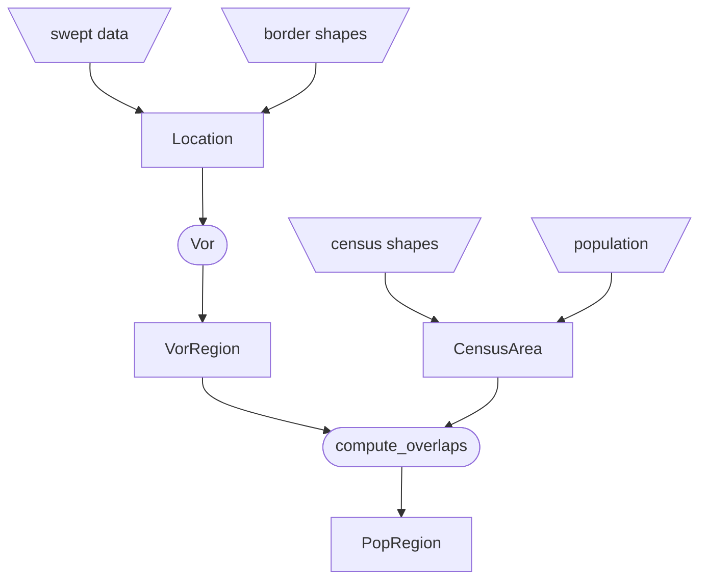

# resto-voronoi

```mermaid
graph TD
    overlap([compute_overlaps])
    swept_data[\swept data/]
    border_shape[\border shapes/]
    census_shape[\census shapes/]
    population[\population/]
    vor([Vor])
    swept_data --> Location
    border_shape --> Location
    Location --> vor
    vor -->VorRegion
    census_shape --> CensusArea
    population --> CensusArea
    VorRegion --> overlap
    CensusArea --> overlap
    overlap --> PopRegion
```